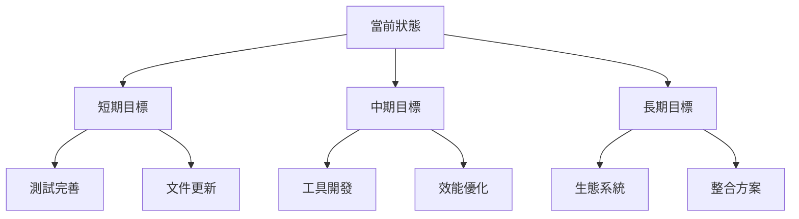

# 活動上下文

## 當前狀態

### 已完成功能
1. ✅ 基本主題顏色設定
   - CSS 變數生成
   - Tailwind colors 擴展
   - 顏色格式轉換

2. ✅ 深色模式支援
   - selector 模式支援
   - media 模式支援
   - color-scheme 設定

3. ✅ 自定義選項
   - 前綴設定
   - 顏色格式選擇
   - 錯誤處理

### 進行中工作
1. 🔄 測試優化
   - 快照測試更新
   - 測試案例完整性
   - 錯誤測試覆蓋

2. 🔄 文件完善
   - API 文件
   - 使用範例
   - 最佳實踐

## 決策記錄

### 架構決策
1. 使用 Tailwind plugin API 而不是 preflights
   - 原因：更好的擴展性和相容性
   - 影響：更容易整合到現有專案
   - 狀態：已實現

2. CSS 變數命名策略
   - 格式：`--{prefix}-{color}-{shade}`
   - 原因：清晰的命名空間管理
   - 狀態：已實現

3. 深色模式處理
   - 支援 selector 和 media 模式
   - 根據 config('darkMode') 決定輸出
   - 狀態：已實現

### 技術決策
1. 使用 colord 處理顏色
   - 原因：輕量且功能完整
   - 替代方案：color, tinycolor2
   - 狀態：已實現

2. 測試策略
   - 使用 Vitest 框架
   - 包含快照測試
   - 狀態：持續優化

## 待辦事項

### 高優先級
1. 📍 完善錯誤處理
   - [ ] 更詳細的錯誤訊息
   - [ ] 錯誤類型定義
   - [ ] 錯誤處理文件

2. 📍 效能優化
   - [ ] CSS 變數生成優化
   - [ ] 選擇器優化
   - [ ] 建置優化

### 中優先級
1. 📌 文件更新
   - [ ] API 文件完善
   - [ ] 更多使用範例
   - [ ] 貢獻指南

2. 📌 測試改進
   - [ ] 效能測試
   - [ ] 邊界案例測試
   - [ ] 整合測試擴展

### 低優先級
1. 📎 工具開發
   - [ ] 主題預覽工具
   - [ ] 設定檔驗證工具
   - [ ] 顏色生成工具

## 注意事項

### 相容性考量
1. Tailwind CSS 版本
   - 最低要求：3.4.0
   - 建議版本：最新版本

2. Node.js 環境
   - 最低要求：18.x
   - 建議版本：LTS

### 已知問題
1. 🐛 深色模式切換
   - 問題：需要正確的 CSS 選擇器優先級
   - 狀態：已修復
   - 解決方案：根據 darkMode 設定生成對應的選擇器

2. 🐛 顏色格式轉換
   - 問題：某些特殊顏色格式處理
   - 狀態：監控中
   - 解決方案：使用 colord 的完整功能

## 下一步計畫

### 短期目標 (1-2週)
1. 完善測試覆蓋
2. 更新文件
3. 修復已知問題

### 中期目標 (1-2月)
1. 開發輔助工具
2. 效能優化
3. 擴展測試

### 長期目標 (3-6月)
1. 建立生態系統
2. 提供整合方案
3. 社群建設