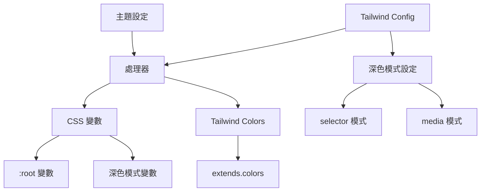

# 產品上下文

## 問題陳述

在使用 Tailwind CSS 開發時，管理主題顏色和深色模式常常需要大量的重複設定，特別是：

1. CSS 變數的命名和管理
2. 深色模式的切換邏輯
3. 顏色格式的轉換
4. 型別安全的確保

這些問題導致開發者需要花費額外的時間在設定上，而不是專注於業務邏輯的開發。

## 解決方案

Tailwind Preset Dark Mode Theme 提供了一個完整的解決方案：



### 核心功能

1. 自動化的 CSS 變數管理
   - 根據主題設定自動生成變數
   - 支援巢狀的顏色結構
   - 自動處理前綴

2. 深色模式整合
   - 支援 selector 和 media 模式
   - 自動設定 color-scheme
   - 正確的 CSS 選擇器優先級

3. 顏色處理
   - RGB 和 HSL 格式支援
   - 自動的顏色格式轉換
   - alpha 通道支援

4. 開發者體驗
   - 完整的 TypeScript 支援
   - 清晰的錯誤訊息
   - 直觀的 API 設計

## 使用場景

### 場景一：基本主題設定
```typescript
const theme = {
  colors: {
    primary: {
      '50': '#f8fafc',
      '100': '#f1f5f9'
    }
  }
}
```

### 場景二：深色模式支援
```typescript
const theme = {
  light: {
    colors: {
      primary: { '50': '#f8fafc' }
    }
  },
  dark: {
    colors: {
      primary: { '50': '#0f172a' }
    }
  }
}
```

### 場景三：自定義設定
```typescript
createPreset(theme, {
  prefix: 'custom',
  colorFormat: 'hsl'
})
```

## 使用者價值

1. 開發效率
   - 減少重複的設定工作
   - 自動化的顏色管理
   - 快速的主題實現

2. 程式碼品質
   - 型別安全
   - 一致的命名規範
   - 可維護的結構

3. 使用者體驗
   - 正確的深色模式支援
   - 一致的顏色表現
   - 效能優化

## 未來展望

1. 功能擴展
   - 動態主題切換
   - 更多顏色格式支援
   - 主題預設值

2. 開發工具
   - 主題預覽工具
   - 顏色生成工具
   - 設定檔驗證工具

3. 生態整合
   - 更多框架支援
   - 設計工具整合
   - 社群主題分享