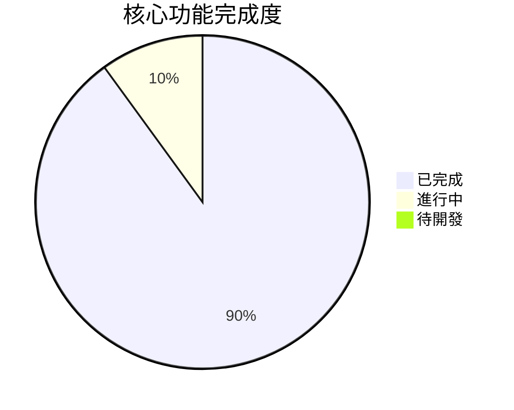
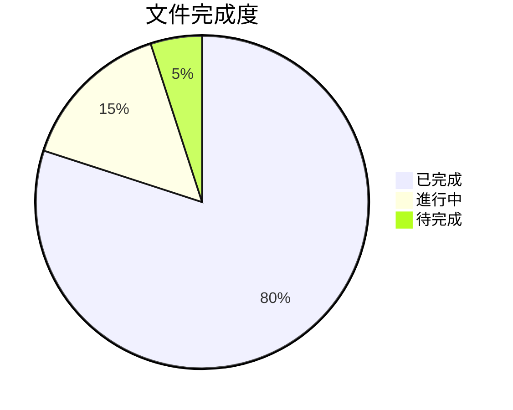

# 進度追蹤

## 功能完成度

### 核心功能

#### 已完成 ✅
1. 主題顏色設定
   - [x] CSS 變數生成
   - [x] Tailwind colors 擴展
   - [x] 顏色格式轉換

2. 深色模式支援
   - [x] selector 模式
   - [x] media 模式
   - [x] color-scheme 設定

3. 自定義選項
   - [x] 前綴設定
   - [x] 顏色格式選擇
   - [x] 錯誤處理

#### 進行中 🔄
1. 測試優化
   - [x] 基本測試覆蓋
   - [ ] 效能測試
   - [ ] 邊界案例測試

### 文件完成度

#### 已完成 ✅
1. 基礎文件
   - [x] README.md
   - [x] API 文件
   - [x] 使用範例

2. Memory Bank
   - [x] projectbrief.md
   - [x] productContext.md
   - [x] systemPatterns.md
   - [x] techContext.md
   - [x] activeContext.md
   - [x] progress.md

#### 進行中 🔄
1. 進階文件
   - [ ] 最佳實踐指南
   - [ ] 貢獻指南
   - [ ] 效能優化指南

## 里程碑

### 1.0.0 版本
- [x] 核心功能實現
- [x] 基本測試覆蓋
- [x] 基礎文件完成
- [ ] 效能優化
- [ ] 完整文件

### 1.1.0 版本 (計畫中)
- [ ] 效能優化
- [ ] 工具開發
- [ ] 文件完善
- [ ] 社群建設

## 當前重點

### 本週重點
1. 🎯 測試優化
   - 完善測試案例
   - 提高測試覆蓋率
   - 添加效能測試

2. 📚 文件更新
   - 補充使用範例
   - 添加最佳實踐
   - 更新 API 文件

### 下週計畫
1. 🔍 效能優化
   - CSS 選擇器優化
   - 建置效能優化
   - 運行時優化

2. 🛠 工具開發
   - 主題預覽工具
   - 設定檔驗證
   - 開發環境整合

## 問題追蹤

### 已解決 ✅
1. 深色模式選擇器優先級
   - 問題：CSS 選擇器衝突
   - 解決：根據 darkMode 設定調整選擇器
   - 版本：1.0.0-beta.1

2. 顏色格式轉換
   - 問題：特殊顏色格式處理
   - 解決：使用 colord 完整功能
   - 版本：1.0.0-beta.2

### 待解決 ⏳
1. 效能優化
   - 優先級：中
   - 狀態：評估中
   - 計畫：1.1.0 版本

2. 開發工具
   - 優先級：低
   - 狀態：規劃中
   - 計畫：1.2.0 版本

## 版本歷程

### 1.0.0-beta.2 (當前)
- ✨ 完善深色模式支援
- 🐛 修復顏色轉換問題
- 📚 更新文件

### 1.0.0-beta.1
- 🎉 首次發布
- ✨ 基本功能實現
- 📝 基礎文件

### 下一版本計畫
1. 1.0.0
   - 完整測試覆蓋
   - 效能優化
   - 完整文件

2. 1.1.0
   - 開發工具
   - 擴展功能
   - 社群整合