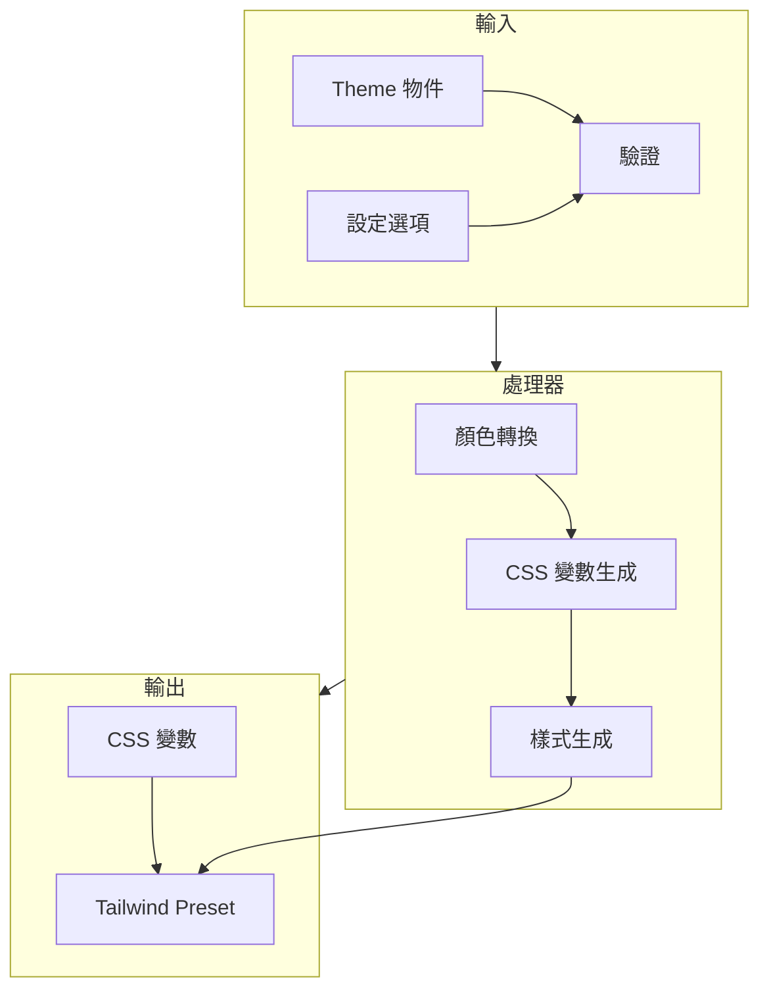
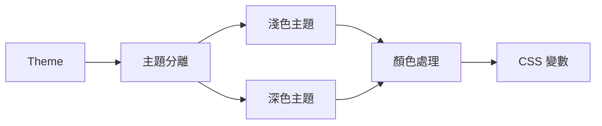
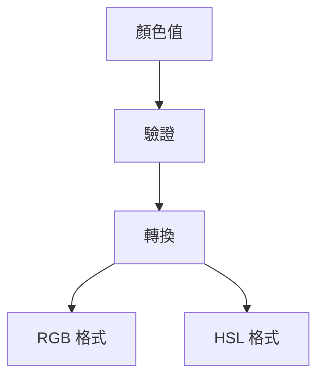
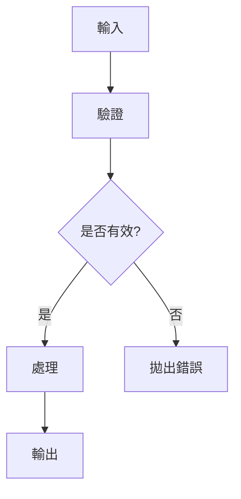
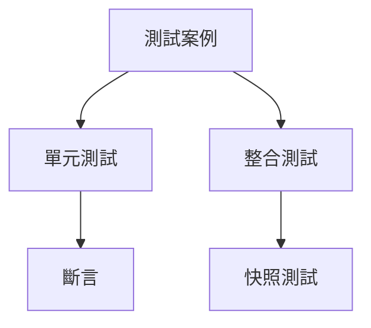
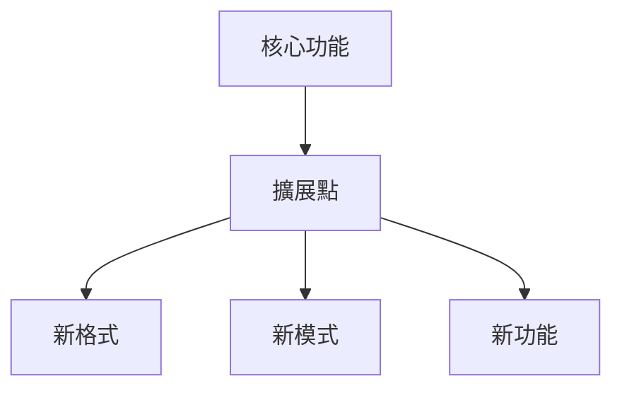

# 系統模式

## 架構概覽



## 核心模式

### 1. 主題處理模式



- 支援單一主題或淺色/深色主題
- 自動分離主題設定
- 統一的處理流程

### 2. 顏色處理模式



- 顏色格式驗證
- 格式轉換
- 錯誤處理

### 3. CSS 變數生成模式

```mermaid
flowchart TD
    Vars[CSS 變數] --> Root[:root]
    Vars --> Dark[深色模式]
    Dark --> Selector[.dark]
    Dark --> Media[@media]
```

- 變數命名規範
- 選擇器優先級
- 深色模式支援

## 設計模式

### 1. Factory Pattern
用於創建 Tailwind preset：
```typescript
function createPreset(theme: Theme, options?: PresetOptions): Config
```

### 2. Strategy Pattern
用於處理不同的顏色格式：
```typescript
function convertColor(color: string, format: 'rgb' | 'hsl'): string
```

### 3. Builder Pattern
用於構建 CSS 變數和樣式：
```typescript
function processThemeColors(
  themeColors: ThemeColors,
  prefix: string,
  format: 'rgb' | 'hsl'
): { cssVars: Record<string, string>, colors: Record<string, any> }
```

## 錯誤處理模式



### 驗證層級
1. 主題結構驗證
2. 顏色值驗證
3. 選項驗證

### 錯誤類型
1. 無效的顏色值
2. 無效的主題結構
3. 無效的選項值

## 測試模式



### 測試範圍
1. 基本功能測試
2. 深色模式測試
3. 錯誤處理測試
4. 快照測試

## 擴展模式



### 擴展點
1. 顏色格式轉換
2. 深色模式處理
3. CSS 變數生成
4. 樣式生成