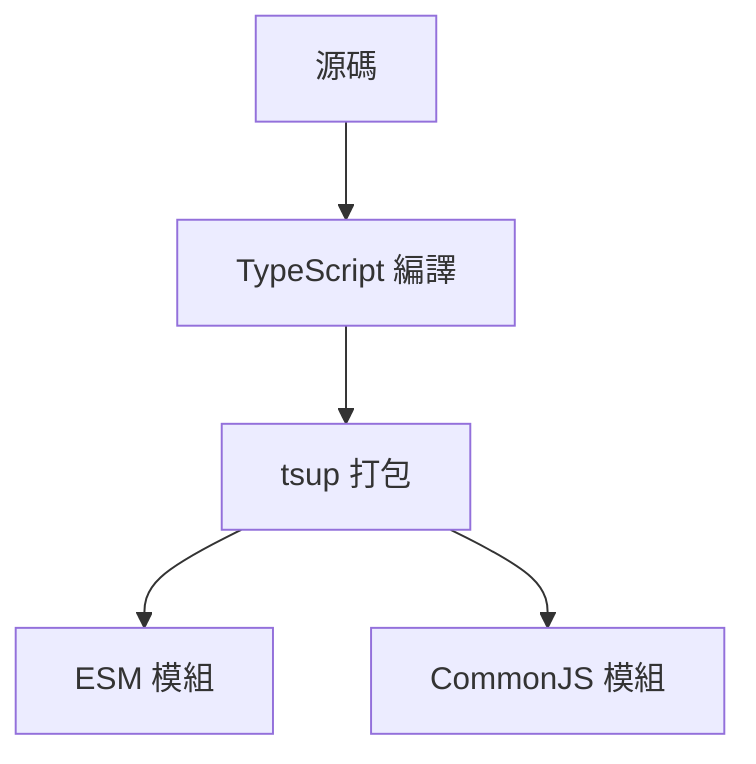
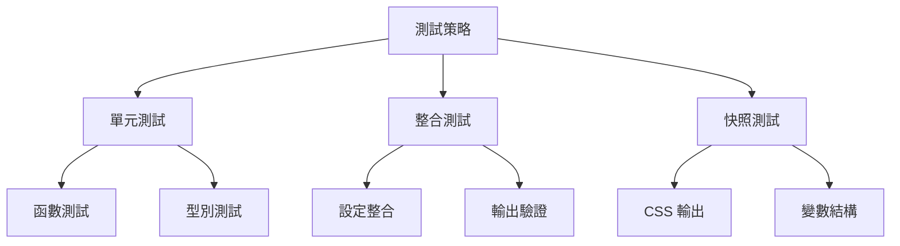
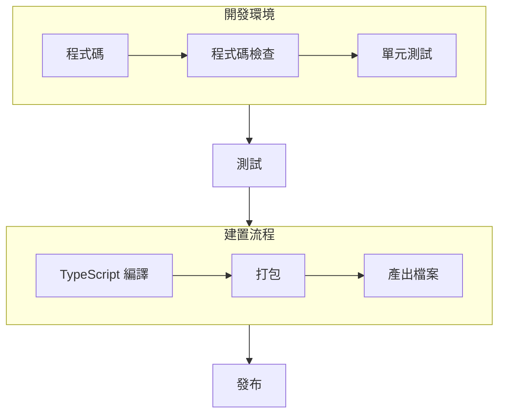

# 技術上下文

## 技術棧

### 核心技術
- Tailwind CSS v3.4.x
- TypeScript v5.x
- colord (顏色處理庫)

### 開發工具
- pnpm (套件管理)
- tsup (建置工具)
- Vitest (測試框架)

## 開發環境

### 必要條件
- Node.js >= 18.x
- pnpm >= 8.x
- TypeScript >= 5.x

### 建置工具


## 專案結構

```
tailwind-preset-dark-mode-theme/
├── src/
│   ├── index.ts          # 主要入口
│   ├── types.ts          # 型別定義
│   └── __tests__/        # 測試檔案
├── memory-bank/          # 專案文件
├── tsconfig.json         # TypeScript 配置
├── tsup.config.ts        # 建置配置
└── package.json          # 專案配置
```

## 依賴關係

### 生產依賴
- tailwindcss: ^3.4.0
- colord: ^2.9.3

### 開發依賴
- typescript: ^5.0.0
- tsup: ^8.0.0
- vitest: ^3.0.0
- @types/node: ^20.0.0

## 技術限制

### 相容性
1. Tailwind CSS 版本要求
   - 最低版本: 3.4.0
   - 建議版本: 最新版本

2. Node.js 環境
   - 最低版本: 18.x
   - 建議版本: LTS 版本

### 效能考量
1. 建置時效能
   - CSS 變數生成
   - 顏色轉換處理

2. 執行時效能
   - CSS 選擇器優化
   - 變數存取優化

## API 設計

### 主要 API
```typescript
function createPreset(
  theme: Theme,
  options?: PresetOptions
): Config
```

### 型別定義
```typescript
type Colors = Record<string, string>
type ThemeColors = Record<'colors', Record<string, Colors | string>>
type Theme = ThemeColors | Record<'light' | 'dark', ThemeColors>

interface PresetOptions {
  prefix?: string
  colorFormat?: 'rgb' | 'hsl'
}
```

## 測試策略



### 測試範圍
1. 單元測試
   - 顏色轉換函數
   - 變數生成邏輯
   - 錯誤處理

2. 整合測試
   - Tailwind 設定整合
   - 深色模式處理
   - 選項處理

3. 快照測試
   - CSS 輸出結果
   - 變數結構
   - 選擇器生成

## 部署流程



### 發布檢查清單
1. 所有測試通過
2. 型別檢查通過
3. 建置成功
4. 文件更新
5. 版本號更新

## 監控與維護

### 版本控制
- 使用語意化版本號
- 維護更新日誌
- 分支管理策略

### 品質監控
- 測試覆蓋率
- 型別完整性
- 程式碼品質